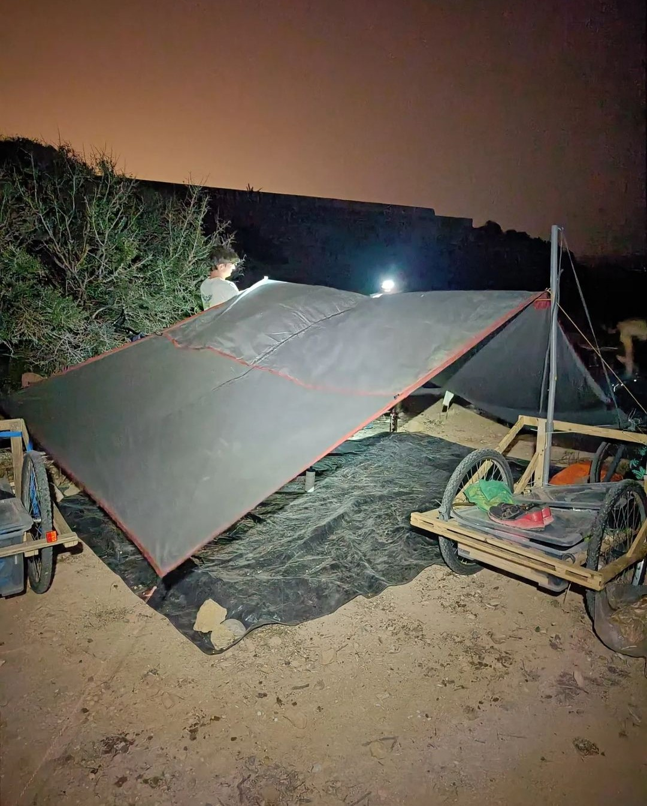

Bienvenue dans un projet d'aventure unique en son genre : une itinérance en vélo le long des magnifiques côtes du Maroc, alliant la passion du surf et du vélo à une approche "Low-Tech".

### Objectifs :

1. **Pratique du Surf :** Le Maroc est célèbre pour ses vagues exceptionnelles. Nous avons l'intention de profiter de chaque opportunité pour surfer sur les meilleures vagues, découvrir différents spots et améliorer nos compétences en surf.

2. **Cyclisme Aventureux :** À bord de nos vélos, nous parcourrons des kilomètres le long de la côte. Le cyclisme nous permettra de vivre la liberté de voyager à notre rythme tout en minimisant notre impact.

3. **Approche Low-Tech et homemade :** Notre équipe a choisi de relever le défi de fabriquer nos propres équipements. Nous croyons en une approche minimaliste et durable, c'est pourquoi nous avons voulu faire tout nous même, en recyclant un maximum de choses.

### Préparation de l'aventure : 

**Carriole :** Cet équipement est nécessaire pour porter tout le matériel (planche de surf, combinaison, ...)

Les carrioles sont faites à partir de planches de palettes. Elles sont agencées en un cadre sur lequel on monte des caisses en plastiques et roues de vélo.

Réalisées sur-mesure et démontables, elles ont une conception assez simple qui nous permettra de les réparer avec les moyens du bord. 

**Planche de surf :** L'équipement qui nous a pris le plus de temps à faire a été la planche de surf. Néophites dans la pratique, nous avons suivi des tutoriels et reçu l'aide de quelques amis pour réaliser cette tache de longue haleine.

Elle se décompose en 4 grandes étapes:

- Découpe et formage du pain de mousse qui forme la base de la planche
- Stratification avec de la fibre de verre et de la résine époxy
- Ajout des emplacements des ailerons et du leash
- Glaçage final avec de l'époxy

Les infrastructures mises à disposition par l'école (ISAE-SUPAERO) nous ont facilité la tâche notamment pour la première étape.
Les plus de 100 heures de travail ont été compilés dans cette vidéo de 40 secondes :

**Logement :** En continuant dans cette approche minimaliste, nous utiliserons des tarps et des bâches (utilisés lors de précédents voyages) pour dormir le long des côtes. Nous espérons pouvoir parfois dormir chez l'habitant ou bien à la belle étoile si le temps le permet.

### Itinéraire :

Evitant de prendre l'avion, nous optons pour le Ferry comme moyen de transport, option qui reste tout de même assez [polluante](https://bonpote.com/ferry-calculer-en-1-minute-son-empreinte-carbone/) pour se déplacer.

Nous arriverons à Agadir puis remonterons la côte en vélo en passant par Taghazout, Imsouane, Tafedna et Essaouira. Au programme: plus de 500 kilomètres à parcourir avec plus de 30 kg d'équipement.

### Conclusion :

Notre projet d'itinérance en vélo le long des côtes du Maroc, axé sur le surf, le vélo et l'approche "Low-Tech", a été une aventure mémorables.

Ce projet nous a prouvé qu'une approche minimaliste peut offrir des expériences riches en enseignements et mener à des rencontres inoubliable.

N'hésitez pas à me contacter pour en savoir plus sur le voyage ou sur les équipements que j'ai construit :)
